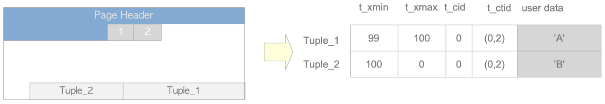
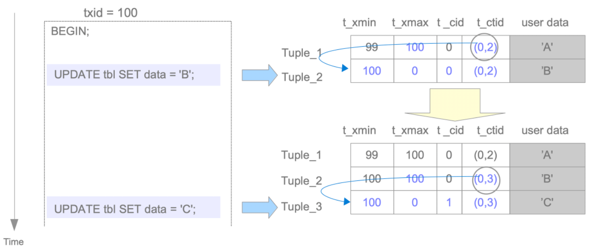

MVCC，全称Multi Version Concurrency Control，即并发版本控制。它本质是为了**解决事务的ACID(Atomicity Consistency Isolation Durability)中 C、I 两部分**。除此之外，MVCC还想解决的是**读写并发冲突，提高读的效率**

MVCC有自己的一套理论和算法，这里不做详细展开，如有兴趣可以自行阅读：

1. [Multiversion Concurrency Control - Theory and Algorithms](https://www.researchgate.net/publication/220225682_Multiversion_Concurrency_Control_-_Theory_and_Algorithms)
2. [Multi Versions and the Performance of Optimistic Concurrency Control](https://ftp.cs.wisc.edu/pub/techreports/1983/TR517.pdf)

为了方便理解，个人觉得MVCC其实可以看做两个问题：

1. MV(Multi Version)：数据可以有多个版本。实现多版本就涉及到数据的组织形式、怎么在多个版本中选择、怎么清理等问题
2. CC(Concurrency Control)：对数据的并发访问。通常就是怎么做并发控制

> <u>MC和CC两个其实相互关联、相互影响的，宏观上来看，它们之间的关系就如同数据结构与算法(微观局部来看，它们自身也有着内在的数据结构和算法)</u>。在解决MVCC问题的时候，必然需要设计一种合理的结构，再实现一种基于该结构的算法。
> 此处只是为了便于理解，从不同的侧重点来看待它们解决的问题

# MV

Multi Version是通过一些特殊设计的数据结构来实现的，设计到以下三个方面。他们共同解决多版本的可见性、可用性

- tuple的结构
- 快照
- clog，或者在PG 10以上的版本中也被称为xact_log

## tuple

tuple的结构设计来完成的。PG有两种页面，数据(Heap)和索引(Index)，它们都使用着`PageHeaderData`作为自己的页面头，并具备类似的页面结构，其基本结构图如下。不过，MVCC只涉及Heap，不涉及Index



### 数据结构

Heap tuple的基本数据结构为`HeapTupleFields`、`HeapTupleHeaderData`等，具体参数可以参见源码。此处，我们专注于MV问题，暂时不深入介绍上述结构体的一些细枝末节，例如`TransactionId t_xvac;	/* old-style VACUUM FULL xact ID */`等部分的作用

在MV中，将我们需要关注的结构体参数提取出来，精简成如下形式：

```c
typedef struct HeapTupleFields
{
	TransactionId t_xmin; /* tuple创建时的xid，只在创建时被记录，后续不再变化 */
	TransactionId t_xmax; /* 锁定或者删除tuple的xid，若尚未删除此元组，则设置为0 */
	CommandId	t_cid;    /* 记录一个事务中产生写操作(例如ddl,dml)的ID，单调递增。例如，在单个事务中执行三条INSERT命令。第一条命令插入tuple的t_cid为0.第二条命令插入tuple的t_cid为1，依此类推 */
} HeapTupleFields;

typedef struct ItemPointerData
{
	BlockIdData ip_blkid;
	OffsetNumber ip_posid;
}

struct HeapTupleHeaderData
{
	ItemPointerData t_ctid;		/* 保存着指向自身或者新元组的元组标识（tid）。由两个数字组成，第一个数字代表物理块号，或者叫页面号，第二个数字代表元组号。在元组更新后tid指向新版本的元组，否则指向自己，这样其实就形成了新旧元组之间的“元组链” */

	/* Fields below here must match MinimalTupleData! */
#define FIELDNO_HEAPTUPLEHEADERDATA_INFOMASK2 2
	uint16		t_infomask2;	/* number of attributes + various flags */

#define FIELDNO_HEAPTUPLEHEADERDATA_INFOMASK 3
	uint16		t_infomask;		/* various flag bits, see below */
};
```

### 实现

因为在PG中，Update本质就是先Delete，再Insert，所以为了更方便的说明MV的实现，这里将Delete与Update归在一起讲解

> 下面查看tuple结构是通过`pageinspect`插件完成，可以参考[pageinspect安装](./pageinspect.md)自行操作

以下操作均基于这张表：

```sql
test=# create table test(id int PRIMARY KEY, name text);
CREATE TABLE
test=# \d+ test;
                                           Table "public.test"
 Column |  Type   | Collation | Nullable | Default | Storage  | Compression | Stats target | Description 
--------+---------+-----------+----------+---------+----------+-------------+--------------+-------------
 id     | integer |           | not null |         | plain    |             |              | 
 name   | text    |           |          |         | extended |             |              | 
Indexes:
    "test_pkey" PRIMARY KEY, btree (id)
Access method: heap
```

#### Insert

命令如下：

```sql
test=# begin;
BEGIN
test=*# SELECT txid_current() txid;
 txid 
------
  985
(1 row)

test=*# insert into test values(1, 'zhang san');
INSERT 0 1
test=*# insert into test values(2, 'li si');
INSERT 0 1
test=*# insert into test values(3, 'wang wu');
INSERT 0 1
test=*# commit;
COMMIT
```

执行完成后的结果如下：

```sql
test=# select * from test;
 id |   name    
----+-----------
  1 | zhang san
  2 | li si
  3 | wang wu
(3 rows)

test=# SELECT lp as tuple, t_xmin, t_xmax, t_field3 as t_cid, t_ctid FROM heap_page_items(get_raw_page('test', 0));
 tuple | t_xmin | t_xmax | t_cid | t_ctid 
-------+--------+--------+-------+--------
     1 |    985 |      0 |     0 | (0,1)
     2 |    985 |      0 |     1 | (0,2)
     3 |    985 |      0 |     2 | (0,3)
(3 rows)
```

解释如下：

1. 3个tuple都在同一个事务内插入，所以`t_xmin`相同
2. 3个tuple不涉及删除，所以`t_xmax`均为0
3. 本次事务中，依次执行了这3个tuple的插入命令，所以`t_cid`依次编号为0、1、2
4. 3个tuple都位于表`test`的第0个页面，所以`t_ctid`的第一个数字为0
   - 以第一个tuple为例，这个tuple是新增的，也没有任何的修改、删除等，所以`t_ctid`的第二个数字为1，指向`tuple = 1`的位置，即它自身
   - 其它以此类推

#### Update/Delete

命令如下：

```sql
test=# begin;
BEGIN
test=*# SELECT txid_current() txid;
 txid 
------
  987
(1 row)

test=*# delete from test where id = 2;
DELETE 1
test=*# commit;
COMMIT


test=# begin;
BEGIN
test=*# SELECT txid_current() txid;
 txid 
------
  988
(1 row)

test=*# update test set name='ma zi' where id=1;
UPDATE 1
test=*# commit;
COMMIT
```

执行后的结果如下：

```sql
test=# select * from test;
 id |  name   
----+---------
  3 | wang wu
  1 | ma zi
(2 rows)

test=# SELECT lp as tuple, t_xmin, t_xmax, t_field3 as t_cid, t_ctid FROM heap_page_items(get_raw_page('test', 0));
 tuple | t_xmin | t_xmax | t_cid | t_ctid 
-------+--------+--------+-------+--------
     1 |    985 |    988 |     0 | (0,4)
     2 |    985 |    987 |     0 | (0,2)
     3 |    985 |      0 |     2 | (0,3)
     4 |    988 |      0 |     0 | (0,4)
(4 rows)
```

解释如下：

1. 原本`id = 2`，即`tuple = 2`的位置被删除，执行这条命令的事务`xid = 987`。所以`tuple = 2`的这行数据，`t_xmax`被更新为987
2. 原本`id = 1`，即`tuple = 1`的位置被更新。它等价于先删除，后插入
   - `tuple = 1`这一行被删除/更新，所以`t_xmax`被更新为`xid = 988`
   - 这时会新插入一行，信息为update后的新数据，所以表`test`新增了一行，放在`tuple = 4`的位置，`t_xmin`被更新为`xid = 988`
   - 原本`tuple = 1`的这一行虽然被删除，但实际会形成多版本链，此时`t_ctid`的第二个数字被修改为新的tuple位置，即`tuple = 4`的位置

如果上述不够形象，可以参考[The Internals of PostgreSQL: Concurrency Control](http://www.interdb.jp/pg/pgsql05.html#_5.2.)中的示意图：



## 快照

### 数据结构


### 实现


## Clog/xact_log

clog的详细介绍可以参考[clog/xact_log](./xact_log.md)，这里只讨论与MVCC实际相关的部分


# CC

Concurrency Control主要是通过锁机制来实现的


# 参考资料

1. [主流数据库（Oracle/MySQL/PostgreSQL）的MVCC原理及实现介绍](http://3ms.huawei.com/hi/group/3288655/wiki_5125919.html)
2. [The Internals of PostgreSQL: Concurrency Control](http://www.interdb.jp/pg/pgsql05.html#_5.2.)
