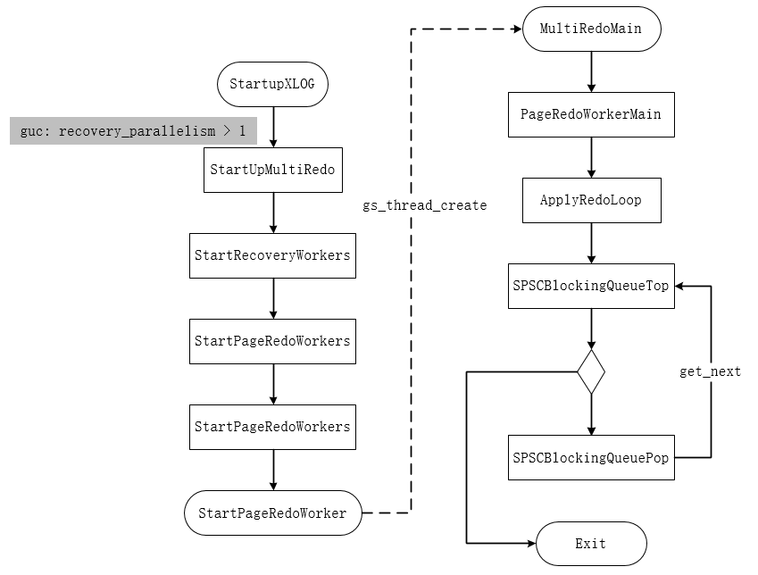

并行回放是对PG系统原有的redo_log串行式回放的优化，其根本出发点是为了提升RTO(Recovery Time Object, 即系统从崩溃到恢复正常的耗时)。当然，并行回放也有助于主备集群中，备机处理redo_log的速度

要实现redo_log的并行回放，需要解决以下几个问题：

1. redo_log中涉及的资源类型有多种，及对应的操作有多种，是否所有的操作都可以并行？
2. redo_log设计之初最大的问题就是如何保序，PG系统采用串行回放本质上也是让恢复操作维持redo_log的记录顺序。换成并行回放之后，该如何解决保序问题？

# 了解入口

redo_log管理的资源类型较多，以PG为例，涉及到page、index等(可参考[PosgreSQL总结中的redo_log对应部分](../PostgreSQL/redo_log.md#哪些操作会记入redo_log))。对于OpenGauss而言，其涉及到的资源类型和其下的操作又有所不同，资源类型具体可以参考`rmgrlist.h`文件中的定义，每种资源对应的操作需要查看对应的头文件，如HEAP相关的记录在`htup.h`。

某些操作，比如`create tablespace`、`create database`等操作，影响到数据表很多；而另一些操作，比如`insert`、`update`等，基本只会涉及到单表，或者几张表

这种情况下，只能慢工出细活，按照redo_log中记录的资源类型进行逐个排查。最终，形成了目前`dispatcher.cpp`中的资源分数组`RmgrDispatchData g_dispatchTable[RM_MAX_ID + 1]`，这个数组即是并行回放的核心。其元素类型为`RmgrDispatchData`，含义如下：

```c++
typedef struct {
    /* 分发函数 */
    bool (*rm_dispatch)(XLogReaderState *record, List *expectedTLIs, TimestampTz recordXTime);
    /* 无效info(即XLogRecord中的xl_info)判断函数 */
    bool (*rm_loginfovalid)(XLogReaderState *record, uint8 minInfo, uint8 maxInfo);
    /* 资源id */
    RmgrId rm_id;
    /* 本资源id下，当前分发处理类型中，允许的min info */
    uint8 rm_mininfo;
    /* 本资源id下，当前分发处理类型中，允许的max info */
    uint8 rm_maxinfo;
} RmgrDispatchData;
```

这个数组虽然针对每种资源类型，都有对应的处理函数，但实际上，最终只涉及到两种处理逻辑：`AddTxnRedoItem`和`AddPageRedoItem`。

总体流程图如下：



# 回放怎么保序

其实回放怎么保序与哪些操作可以并行两个是关联在一起的。日志之间的依赖有两种情况：

- 两个事务之间存在依赖关系，例如插入数据肯定是在建表之后
- 同一个事务内有顺序依赖，例如先插入某条记录，再删除这条记录，删除必须在插入之后执行

为了解决redo_log并行回放过程中的保序性，引入了以下两种机制。必须注意：**并行回放只能保证单个事务所涉及数据的最终一致性，事务内的执行不会按照用户原有的操作顺序**

1. 只有单生产、单消费，一个阻塞队列。一个阻塞队列即所有需要回放的redo_log记录都由生产者解析并放入到这个队列中，而队列的另一端也只有一个消费者读出redo_log记录，并调度后续的并行回放线程处理
2. 如前所述，根据资源类型对回放的记录做了两种划分，一种是与表文件相关的，如CRUD操作；另一种是与一整个事务相关的，如clog提交
   - 与表文件相关的操作可以按照表的oid进行来划分多线程，即表与表之间是相互独立的。但是对前面提到的一个问题，一张表可能有多次操作，例如先insert，后delete
     - 这其实与第1点相关，单队列的形式确保了LSN的有序性，
     - 除非涉及到对整表的修改（如truncate），不然表的relfilenode不会发生变化。所以根据relfilenode做进一步的细分：**同样的表oid下，只有同一个relfilenode的操作才会放入一个线程中**，而对`XLOG_SMGR_TRUNCATE`操作，必须先等待之前relfilenode下的所有操作执行完毕
   - 与事务相关的redo_log记录，因为无从判断涉及到的表文件范围，所以只能等待所有的表文件线程处理完毕之后，才能执行回放。这里的判断逻辑，是根据LSN来进行，即**所有比当前事务记录的LSN小的回放完毕之后，这条事务记录才会开始回放**

# 某些问题及优化

1. 对于drop table、drop database场景，可能出现执行完毕后，redo_log还没有打上checkpoint的场景。如此一来，系统在重启回放redo_log的时候，此时flash中其实已经不存在对应的table、database了，而回放过程中可能涉及到这些被drop的page

   - 可以先将这些page标记为`invalid page`，等回放到drop table、drop database这些位置之后，再统一将这些page清理掉

2. 对于备机build和主机业务量过大，备机始终来不及回放的场景下

   - 备机的redo_log可以不从磁盘上读取，而是直接从WALReceiverBuff中读取，并进行分发

     > 正常WAL主备复制，备机收到日志后，会先写到磁盘，然后再执行回放

3. 对于某些场景，如果单表的操作非常频繁（如Benchmark TPCC），会导致某个表文件处理线程很繁忙，而其它的线程都在等待

   - 可以进一步按照BlockNum对表进行划分，即同一张表下，再按照BlockNum拆分线程