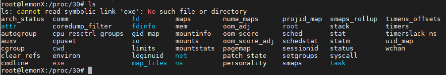
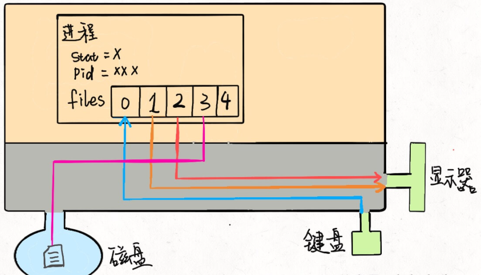
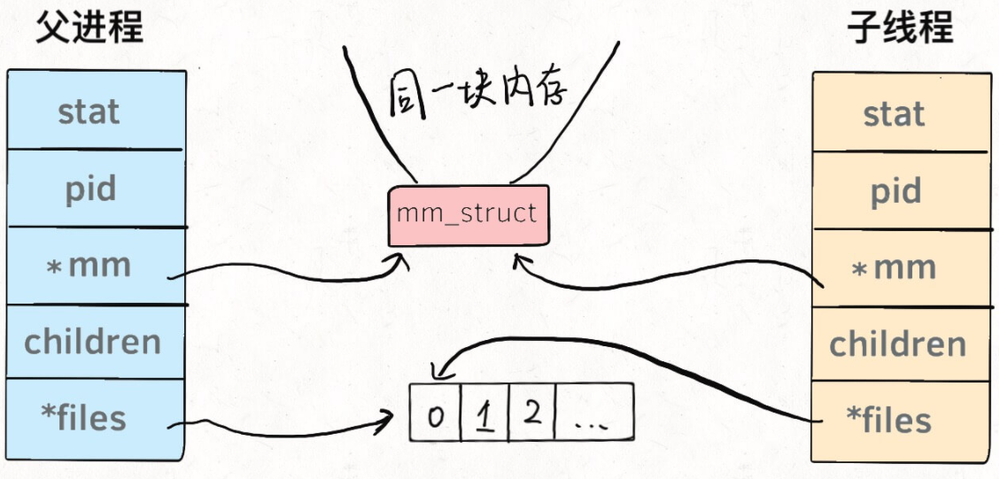

# Linux进程

在阐述PG后台进程之前，先简单阐述Linux进程的特点。如对此已经熟悉，请跳过

**在Linux系统中，进程与线程本质相同，或者说几乎没有区别**。进程可以被认为是：

1. 系统资源（CPU时间、内存等）分配的基本单位
2. 是可执行程序的一个运行实例

从Linux的实现代码来说，进程相关的信息，都存放在`task_struct`结构体中（源码较为复杂， 此处只是提取了部分），它也被称为进程描述符

```c
struct task_struct {
    long state;                        // 进程状态
    struct mm_struct* mm;              // 虚拟内存结构体
    pid_t pid;                         // 进程号
    struct task_struct __rcu* parent;  // 指向父进程的指针
    struct list_head children;         // 子进程列表
    struct fs_struct* fs;              // 存放文件系统信息的指针
    struct files_struct* files;        // 一个数组，包含该进程打开的文件指针
};
```

其中，`mm`指向进程的虚拟内存，也就是载入资源和可执行文件的地方；`files`指向一个数组，这个数组里装着所有该进程打开的文件的指针。针对该`task_struct`有两点可以稍作了解：

1. 可以在任意linux系统中，找到对应的源码，例如`linux-hwe-5.13-headers-5.13.0-35/include/linux/sched.h`（最前方的`linux-hwe-5.13-headers-5.13.0-35`不一定相同，这与linux版本有关）

2. 进程的信息可以在`/proc`路径下查看，例如`pid=30的信息，就存放在`/proc/30`的文件夹下

   

## 一切皆文件

一切皆文件只是一种面向对象的设计思想，在Linux也同样采用了。比如，将进程(`/proc`)、设备(`/dev`)、Socket等等，这些本来在直观理解上并非文件的东西，都通过文件系统的规则来管理和使用，比如像普通文件一样访问、修改属性...

以操作一个摄像头为例，其按照文件系统的规范被设置为`/dev/video0`，在C语言中，调用`open(/dev/video0)`就可以连接这个设备，然后通过`read(/dev/video0)`就可以读出一帧一帧的图像

那么对于`task_struct`而言，其下的`files`数组中，每个指针实际指向的可能就是不同的硬件外设，类似如下：



### 重定向

在上述设计下，对重定向就很容易理解了。比如，程序原本需要读取键盘的输入，但是通过**输入重定向**，就可以将其指向一个文件

```shell
command < file1.txt
```

同理，通过**输出重定向**，把原本需要打印到屏幕上的文字，可以写入到一个文件中保存起来

```shell
command > file2.txt
```

**管道符**也是同样的原理，可以把一个进程的输出与另外一个进程的输入串接起来，形成一条*管道*，数据就在其中传递

```shell
command1 | command2 | command3
```

## 子进程与线程

在Linux中，一般通过`fork()`来创建子进程，通过`pthread()`创建线程。但无论是进程还是线程，都是通过`task_struct`来管理或者描述其信息，唯一的区别就是共享的数据区域不同。

1. 对子进程而言，其数据区域是父进程的拷贝。另外，在Linux中对新建子进程通常采用`copy-on-write`策略进行优化，即创建时并未实际复制父进程的内存空间，而是等到执行写操作时才会去复制
2. 对线程而言，其数据区域与父进程是共享的




