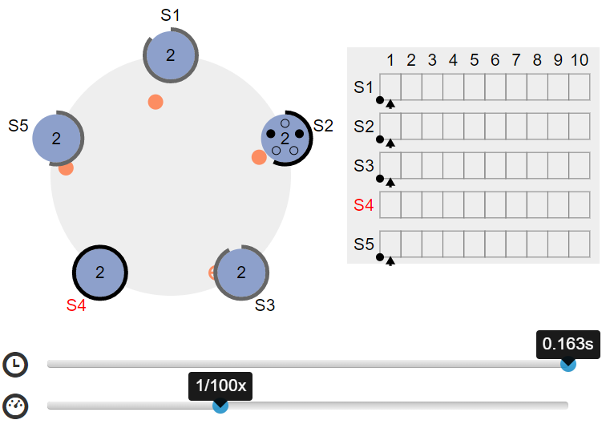

# 2PC

2PC(Two Phase Commit)分为两个阶段

- 1.请求阶段或准备阶段(Propose Phase)
  - 1.1. Coordinator向所有Participator发送消息，询问是否已经完成准备，等待反馈
  - 1.2. Participator收到消息，向Coordinator回复消息同意或不同意
  - 1.3. Coordinaror收到所有Participator的回复，如果所有Participator都同意，则进入下一阶段发送“commit”消息，否则下一阶段将发送“abort”消息

- 2.提交阶段(Commit Phase)
  - 2.1. Coordinator向所有Participator发送消息，等待反馈
  - 2.2. Participator收到消息，进行提交，向Coordinator回复消息成功或者失败
  - 2.3. Coordinator收到所有Participator的回复，如果所有Participator都成功，则记录成功，否则失败

> 以上为一套标准流程，在真正实现时并不完全遵循，通常最有可能出现的变化的是步骤1.3，如果有Participator回复不同意，那Coordinaror可能直接在这一步进行终止，而不会进入到下一阶段，这涉及到Participator在Propose阶段中是否有资源被锁定。

下图分别是提议通过和提议未通过时的2PC流程


> 2PC的通俗解释：A约B、C去吃饭，首先得通过发信息、打电话或者面谈等方式约好时间地点等，B和C都同意了才能定下来，这个就是2PC的Prepare阶段；然后真到了去吃饭的时候，可能B、C中某个临时有事去不了，或者最终都能去了，反正直到饭桌上才能知道这顿饭吃没吃成
>
> 换到机器来说，每台机器都有自己的事情要处理，2PC过程中其不一定有时间有资源来执行

## 2PC在事务数据库中的特殊处理

在事务操作中，因为需要保证ACID特性，所以在2PC阶段需要记录相应的日志，以确保如果中间某一步骤失败时，能够完成操作回滚，从而不影响数据的一致性。

例如Participator在1.2步骤中记录事务操作，并写入redo/undo日志，以便事务的快速回滚等

### 2PC在PG-XC中的实践

PG-XC版本是一个OLAP的数据库，同样也是支持分布式事务，它的组件共有三种：GTM、CN、DN

1. GTM：负责统一协调并下发snapshot、以及全局事务id
2. CN：Coordinator Node，即协调者，又可以视为计算节点，主要负责SQL解析、优化以及计算部分，在2PC协议中充当协调者角色。集群中的元数据会在所有CN中都保存一份。
3. DN：Data Node，即数据节点。是实际存储和管理数据的节点，在2PC协议中充当参与者角色，在部分算子下推场景中同样负责一部分。对DN而言，数据是经过hash分布的，即不同DN上存储的数据可能是不同的。

在PG-XC集群中，每个2PC事务会选定一个CN作为Coordinator，其它在本次事务中涉及到的节点为Participator。根据情形不同分为几种：

1. DDL语句。其函数调用为：

```c++
CommitTransaction
    PrepareTransaction
        PrePrepare_Remote
            pgxc_node_remote_prepare
            AtEOXact_GlobalTxn
            MarkAsPreparing
            StartPrepare
            EndPrepare
    RecordTransactionCommit
    PreCommit_Remote
    ...(释放资源等)
```


2. 跨DN的DML语句。这种DML语句需要整合多个DN节点的数据，一般数据整合会在CN中完成，DN只负责它自身的数据。其函数调用为：

```c++
CommitTransaction
    PrePrepare_Remote
    pgxc_node_remote_prepare
        AtEOXact_GlobalTxn
    RecordTransactionCommit
    PreCommit_Remote
    ...(释放资源等)
```


3. 单DN的DML语句。这部分函数调用与2相同


4. 事务回滚。这部分内容其实分别对应上述三种情况下执行失败后的回滚操作，单独列出来只是为了强调在回滚过程中同样需要遵循2PC的流程，流程如下:
   

> 2PC设计时为什么是GTM先提交，然后CN，然后DN的顺序？
>
> > 因为GTM先提交可以确保GTM的信息是最新最准确的，其次CN，再次DN。这个过程会存在时间窗，即可能A事务在CN、DN上还没有提交，但是后开始的B事务从GTM拿到的快照认为A事务已经提交了。这种情况下通过引入Sync等待机制，当B事务执行时，先计算出GTM上已经提交但是CN、DN上未提交的事务，加tuple锁，只有涉及到该tuple的事务会需要等待。
>
> > 而如果把GTM提交放在后面，会出现CN或DN中事务已提交，而拿到的snapshot中这条事务被认为尚处于活跃中，从而出现可见性不一致的情况。其实这种情况同样可以通过与上述类似的方法解决，但是代价会更大一些。因为在CN、DN上判断某个事务是否活跃可以直接查系统表，在内存中就能完成，而判断某个事务是否已经提交则涉及到查日志，可能需要读磁盘。

## 2PC的问题

最原始的2PC在面临下图类似场景时，**会出现数据不一致问题，最后的结果就是一个提交了，一个没有提交**


当然，在实际2PC的代码实现里，一般不会采用这么原始的协议结构。通常会加入检测或者防呆：

- 检测：即CN会检测DN的commit结果，如果有人失败，会回滚事务
- 防呆：如果CN与DN之间的网络通信发生了问题，DN会超时取消事务提交

下面是对这些异常和可靠性手段的详细描述

### 改进

2PC因为其中心化、强一致性的特点，导致其出现问题后比较难处理，典型的问题如下但是不限于这几种情况：

1. 如果Coordinator在正常执行完propose后宕机或者网络出现问题，导致Participator迟迟无法接收到消息，这时Participator上锁定的资源就长时间得不到释放。不过这种情况可以通过两种手段来处理：
   1. Participator超时释放锁，即引入计数机制，在2PC阶段中长时间未接收到Coordinator消息时，自动abort，并释放资源。这种解决办法的问题是只能把原来的资源锁时间缩短，无法从根本上解决
   2. Coordinator集群管理，即2PC阶段中Coordinator挂掉后，通过集群管理选一个新的Coordinator接手。这种解决办法依然需要阻塞资源，所有的Participator需要等到的新的Coordinator上线，同时会引入新的问题，后面讨论
2. 如果Coordinator无问题，而Participator在执行完毕后消息未发出就挂掉或者出现网络故障，此时对Coordinator来说，必然认为事务整体执行失败，此时Coordinator通知所有节点回滚。此时出现故障的Participator无法接收到消息，其解决方式同样有两种
   1. Participator超时释放锁
   2. Participator维持原状态，直到重新加入集群。这种情况同样会引入新问题，后面讨论

因为1.2、2.2引入的新问题类似：假设有3个Participator分别是A、B、C，如果在precommit完成后，Coordinator挂掉，然后Participator中A、B执行成功commit，C执行状态未知，此时集群新拉起一个Coordinator，同时Participator中的C网络故障了。对于新的Coordinator而言，它只看到了A、B成功，而无法分辨C的状态。此时无论新的Coordinator认为执行成功或失败，那一旦C重新加入集群，C的数据都有可能与其它节点不一致。

> PG-XC的解决方式是通过外部二进制工具pgxc_clean，在网络故障或挂掉的节点重新加入集群时执行一次，清理可能的2PC残余，以保持集群事务的一致性。会导致的问题是，如前面的举例，如果A、B成功而C失败，新的Coordinator判断事务执行成功，而C重新加入集群后，由于事务本身的复杂性或其它原因，在清理2PC残余时，可能会选择把A、B中已经提交的事务回滚。这样对于用户来说，就会出现明明没有操作，数据却发生了变化

# Percolator

Percolator模型来自于Google论文，原文可见[Large-scale Incremental Processing Using Distributed Transactions and Notifications](https://www.usenix.org/legacy/event/osdi10/tech/full_papers/Peng.pdf)，网上有一些翻译版本。其中，TiDB就是采用的Percolator算法，可见其[官网介绍](https://pingcap.com/zh/blog/percolator-and-txn)

Percolator是一个优化版本的2PC，分为Pre-write和Commit两个阶段。它有两个前提条件：

- 存储引擎必须支持MVCC
- tuple数据需要额外增加两列，分别是：
  - lock：存放本次事务的锁信息
  - write：存放tuple

流程如下：

## Pre-write


## Commit


## 总结

**总结**

2PC协议有3个问题，性能问题、单点故障和数据不一致。

Percolator模型简化了协调节点和切片的通信流程，让协调节点只跟其中一个primary切片通信，一方面，减少了通信开销，另一方面，避免了因为单点故障，commit阶段部分节点通信失败导致的数据不一致问题。

Percolator在prepare阶段记录了日志，这样即使协调节点故障了，恢复后也可以根据日志来做事务恢复。

Percolator使用异步线程来做资源的释放工作，这样即使协调节点故障了，也不用担心资源得不到释放。

# 3PC

3PC(Three Phase Commit)是对2PC的改进，共分为以下3个阶段

1. CanCommit
   - 1.1 Coordinator向所有Participator发送消息，询问是否可以执行事务提交，等待反馈
   - 1.2 Participator收到消息，向Coordinator回复消息同意或不同意
   - 1.3 Coordinaror收到所有Participator的回复，如果所有Participator都同意，则进入下一阶段发送“preCommit”消息，否则下一阶段将发送“abort”消息
2. PreCommit
   - 2.1 Coordinator向所有Participator发送消息，等待反馈
   - 2.2 Participator收到消息，执行事务，并发送响应结果
   - 2.3 Coordinator收到所有Participator的回复，如果是“abort”消息，则Coordinator记录结果，整个过程到此结束；如果是“preCommit”消息，根据Participator的反馈，如果所有Participator都成功，则进入下一阶段发送“doCommit”消息，否则下一阶段将发送“abort”消息
3. DoCommit（这部分与2PC的Commit阶段相同）
   - 3.1 Coordinator向所有Participator发送消息，等待反馈
   - 3.2 Participator收到消息，执行事务，并发送响应结果
   - 3.3 Coordinator收到所有Participator的回复，如果是“abort”消息，则Coordinator记录结果，整个过程到此结束；如果是“doCommit”消息，根据Participator的反馈，如果所有Participator都成功，则记录成功，如果有任何一个失败，则记录失败

>  一旦进入阶段三，可能会出现2种故障：Coordinator出现问题或者Coordinator和Participator之间的网络故障。无论哪种情况，都会导致Participator无法收到 doCommit 请求或者 abort 请求，针对这种情况，**Participator都会在等待超时之后，继续事务提交**

## 相对2PC的优缺点

3PC本质是针对[2PC的问题](#2PC的问题)所进行的改善，来看下Participator如果在不同的阶段异常时，3PC的处理

1. CanCommit阶段: coordinator或watchdog未收到宕机participant的vote，直接中止事务；宕机的participant恢复后，读取logging发现未发出赞成vote，自行中止该次事务
2. PreCommit阶段: coordinator未收到宕机participant的precommit ACK，但因为之前已经收到了宕机participant的赞成反馈(不然也不会进入到阶段2)，coordinator进行commit；watchdog可以通过问询其他participant获得这些信息，过程同理；宕机的participant恢复后发现收到precommit或已经发出赞成vote，则自行commit该次事务
3. DoCommit阶段: 即便coordinator或watchdog未收到宕机participant的commit ACK，也结束该次事务；宕机的participant恢复后发现收到commit或者precommit，也将自行commit该次事务


因此3PC的优点是：非阻塞的，即使单点故障后，也能够往下执行，**避免了资源的长时间阻塞**

与之相伴的缺点也很明显：如果Participator收到了 preCommit 消息后，出现了**网络分区，那么Participator等待超时后，都会进行事务的提交，这必然会出现事务不一致的问题**

# raft

Paxos因为其复杂性难以实现，业界多采用raft作为实际应用，已有raft实现数据库有rsqlite、taurus等，其它比较著名的产品有etcd

> 传送数据库面临的场景正好是Paxos算法可以覆盖的情况

不过raft算法不是一个强一致性算法，其分布式数据一致性为最终一致性，在事务执行过程中，需要满足的是多数派原则：即如果大多数节点执行成功了，则认为事务执行成功。

在[Raft官网](https://raft.github.io/)上，有对选举的模拟动画程序：



## Leader选举

下图是经典的raft协议中一个节点在Follower、Candidate、Leader三种状态之间的变化


概括来说有两点：

1. 集群中同一时刻只有一个Leader，Leader会不停给Follower发送心跳以表明自身的存活状态。如果Leader故障，那么Follower自动转换为Candidate，直到集群重新选出Leader
2. 所有节点启动时都是Follower状态，在一段时间内如果没有收到来自Leader的心跳，从Follower切换到Candidate，发起选举；如果收到majority的造成票（含自己的一票）则切换到Leader状态；如果发现其他节点比自己更新，则主动切换到Follower

## 对外工作

集群在Leader正常时可以对外工作，在接收到客户端请求时，Leader把请求作为日志条目（Log entries）加入到它的日志中(每条日志有个编号，称为log index)，然后并行的向其他服务器发起 AppendEntries RPC复制日志条目。当这条日志被复制到大多数服务器上，Leader将这条日志应用到它的状态机并向客户端返回执行结果。其中，每个日志条目由两部分组成：一部分是产生该Leader时的任期编号(term)，一部分是所需执行的命令


某些Followers可能没有成功的复制日志，Leader会无限的重试 AppendEntries RPC直到所有的Followers最终存储了所有的日志条目

## 数据一致性保证

以上是所有节点正常的情况，如果出现日志异常，如下图：


对应三种情况：

1. 比leader日志少，如上图中的ab
2. 比leader日志多，如上图中的cd
3. 某些位置比leader多，某些日志比leader少，如ef（多少是针对某一任期而言）

raft的解决办法是，如果出现了leader与follower不一致的情况，leader强制follower复制自己的log。通过这些措施raft算法保证了集群的数据一致性：

1. 一个节点得到majority的投票才能成为leader，而节点A给节点B投票的其中一个前提是，B的日志不能比A的日志旧
2. 一个日志被复制到majority节点才算committed

# Paxos

Paxos一般分为Basic Paxos和Multi Paxos算法，Basic Paxos算法过程复杂，不适合运用在实际场景中。有运用的是Multi Paxos，但是Multi Paxos除了在Leader选举阶段和raft有所区别，在对外工作上与raft差别不是很大，同样是多数派机制。所以不再继续分析

# 参考资料

1. [Raft协议详解-Log Replication](https://zhuanlan.zhihu.com/p/29730357)
2. [分布式系统理论基础 - 一致性、2PC和3PC](https://zhuanlan.zhihu.com/p/21994882)
3. [聊聊分布式数据库对2PC的优化](https://www.51cto.com/article/640577.html)
4. [Google Percolator](https://www.iggiewang.cn/2021/02/09/Google-Percolator/)
5. [Large-scale Incremental Processing Using Distributed Transactions and Notifications](https://www.usenix.org/legacy/event/osdi10/tech/full_papers/Peng.pdf)
