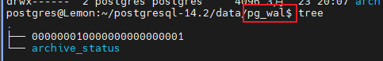
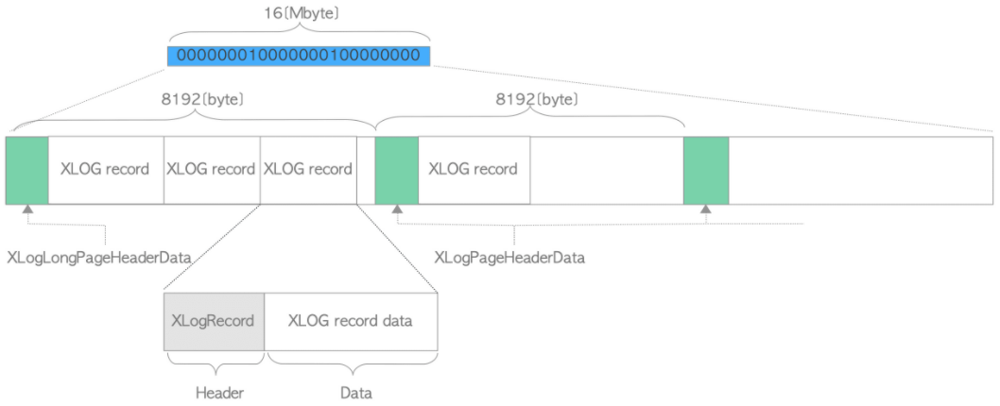
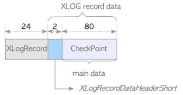
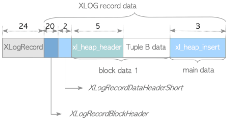
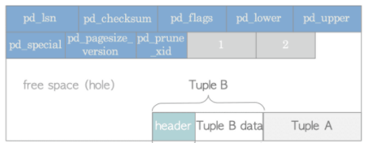
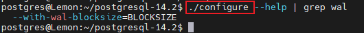
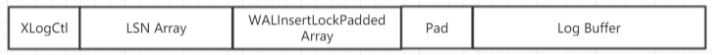

本质来说，redo日志的功能是：所有对数据库的修改动作都会记录一份日志到磁盘中，防止数据库系统因为异常（断电、节点间网络断连等）而出现数据没能及时写到磁盘中，导致数据。有了这份日志，就可以根据日志中的记录信息，恢复数据。

上面这段话潜含了几个信息：

1. 对数据库的修改动作是否生效是以日志为准的。换句话说，如果日志也因为异常没能够保存到磁盘上，那这个操作涉及的数据丢了也无计可施
2. 数据库的机制是日志先行，即所谓的WAL(Write Ahead Log)：预写式日志
3. redo日志就是用来做数据恢复（或者也称为回放）用的

达成上面的共识之后，接下来详细看下PosrgreSQL(以下简称PG)的redo log的细节

> 本文中涉及到的`controlfile`只会在相应小节中介绍对应的操作，其具体功能会放在[how_to_redo](./how_to_redo.md)中说明

# 初始化

在PG执行完`initdb`之后，会在`$PGDATA/pg_wal`目录下生成一份日志文件和一个用来保存归档日志的目录



在`initdb`执行期间，redo_log被初始化的流程为：

```c
initdb
  ├── create_xlog_or_symlink  // 创建redo_log的目录
  └── bootstrap_template1
           └── 调用管道执行：postgres --boot -x1
                   └── main
                         └── AuxiliaryProcessMain
                                 └── BootStrapXLOG
                                        └── XLogFileInit(1, &use_existent, false)
```

其中，redo_log的文件名由`XLogFilePath`得出，在代码中的详细定义如下，可以计算得到在`BootStrapXLOG`调用期间，各项参数为`XLogFilePath(path, 1, 1, 16*1024*1024)`，最终计算得到的文件名为：`00000001-00000000-00000001`

> 最大的redo_log文件名是：`00000001-FFFFFFFF-000000FF`，因为`XLogSegmentsPerXLogId`的最大值是`FF`

```c
#define XLogFilePath(path, tli, logSegNo, wal_segsz_bytes)	\
	snprintf(path, MAXPGPATH, XLOGDIR "/%08X%08X%08X", tli,	\
			 (uint32) ((logSegNo) / XLogSegmentsPerXLogId(wal_segsz_bytes)), \
			 (uint32) ((logSegNo) % XLogSegmentsPerXLogId(wal_segsz_bytes)))

#define XLOGDIR	"pg_wal"

#define XLogSegmentsPerXLogId(wal_segsz_bytes) (UINT64CONST(0x100000000) / (wal_segsz_bytes))

int	wal_segment_size = DEFAULT_XLOG_SEG_SIZE;
#define DEFAULT_XLOG_SEG_SIZE	(16*1024*1024)
```

> `wal_segment_size`参数除了上述代码中给定的默认值外：
>
> 1. 在PG 10版本时是放在configure执行，通过`--with-wal-segsize`参数来指定的，一旦系统启动后就无法更改
>
> 2. 在PG 更高的版本时(没有细查引入该修改版本，仅知道PG 14中已经是了)，`--with-wal-segsize`参数从configure中移除，转而放在了`pg_resetwal`中，变为了`--wal-segsize`参数
>
>    

此时创建的redo_log中除了一个文件头，并没有什么有效数据，只以全0填充，最终的大小是等于`wal_segment_size=16777216`

# 文件结构

对redo_log而言，其文件结构如下：



1. 在每个segment的第一个page的头部，会写入`XLogLongPageHeaderData`

   > redo_log的blocksize是通过configure根据参数`--with-wal-blocksize`在启动前就设置好的，默认为8K，与PG系统中所有的page页面大小保持一致

   ```c
   typedef struct XLogLongPageHeaderData
   {
   	XLogPageHeaderData std;		/* standard header fields */
   	uint64		xlp_sysid;		/* 根据pg_control得到，本质是由系统时间计算得出 */
   	uint32		xlp_seg_size;	/* just as a cross-check，即wal_segment_size，默认16M */
   	uint32		xlp_xlog_blcksz;	/* just as a cross-check，即blocksize，默认8K */
   } XLogLongPageHeaderData;
   
   gettimeofday(&tv, NULL);
   sysidentifier = ((uint64) tv.tv_sec) << 32;
   sysidentifier |= ((uint64) tv.tv_usec) << 12;
   sysidentifier |= getpid() & 0xFFF;
   longpage->xlp_sysid = sysidentifier;
   ```

2. 在每个page的头部(不是segment的第一个page时)，会写入一个`XLogPageHeaderData`

   ```
   /*
    * Each page of XLOG file has a header like this:
    */
   #define XLOG_PAGE_MAGIC 0xD10D	/* can be used as WAL version indicator */
   
   typedef struct XLogPageHeaderData
   {
   	uint16		xlp_magic;		/* magic value for correctness checks，固定为XLOG_PAGE_MAGIC */
   	uint16		xlp_info;		/* flag bits, see below */
   	TimeLineID	xlp_tli;		/* TimeLineID of first record on page */
   	XLogRecPtr	xlp_pageaddr;	/* XLOG address of this page */
   
   	/*
   	 * When there is not enough space on current page for whole record, we
   	 * continue on the next page.  xlp_rem_len is the number of bytes
   	 * remaining from a previous page; it tracks xl_tot_len in the initial
   	 * header.  Note that the continuation data isn't necessarily aligned.
   	 */
   	uint32		xlp_rem_len;	/* total len of remaining data for record */
   } XLogPageHeaderData;
   ```

3. 除开文件头的部分，一条真正的redo_log记录部分由`XLogRecord`+数据部分组成。其中，`XLogRecord`如下，而数据部分对于不同类型的操作，其实际存放的信息有所不同。在PG 9.5版本之后，数据部分的结构如下

   ```c
   typedef struct XLogRecord
   {
   	uint32		xl_tot_len;		/* total len of entire record */
   	TransactionId xl_xid;		/* xact id */
   	XLogRecPtr	xl_prev;		/* ptr to previous record in log */
   	uint8		xl_info;		/* flag bits, see below */
   	RmgrId		xl_rmid;		/* resource manager for this record */
   	/* 2 bytes of padding here, initialize to zero */
   	pg_crc32c	xl_crc;			/* CRC for this record */
   	/* 后面紧接着的是XLogRecordBlockHeaders或XLogRecordDataHeader */
   } XLogRecord;
   ```

   - 例如对于checkpoint记录而言，其redo_log记录为

     

   - 例如对insert一条数据而言，其redo_log记录为

     

     > 其中，`xl_heap_header`和`Tuple B data`直接对应tuple的header和data
     >
     > 

## 哪些操作会记入redo_log

这一点其实涉及到`XLogRecord`结构中的`xl_rmid`和`xl_info`，`rmid`全称是Resource Manager Identity(资源管理器Id)。`xl_rmid`和`xl_info`一起构成了一个唯一操作，所有会被记录到redo_log中的操作都会有这两个信息

> 在PG 14版本中，`xl_rmid`多了一个`_ID`后缀（不清楚具体哪个版本引入的），至少在PG 10版本中还没有

- 如对于checkpoint关闭，记录的是`xl_rmid = RM_XLOG_ID, xl_info = XLOG_CHECKPOINT_SHUTDOWN`
- 如对xlog自身新增page，记录的是`xl_rmid = RM_XLOG_ID, xl_info = XLOG_FPI`

可以根据`xl_rmid`对操作的类别进行划分如下：

| 操作           | 资源管理器Id                                               |
| -------------- | ---------------------------------------------------------- |
| 堆表操作       | RM_HEAP, RM_HEAP2                                          |
| 索引操作       | RM_BTREE, RM_HASH, RM_GIN, RM_GIST, RM_SPGIST, RM_BRIN     |
| 序列操作       | RM_SEQ                                                     |
| 事务操作       | RM_XACT, RM_MULTIXACT, RM_CLOG, RM_XLOG, RM_COMMIT_TS      |
| 表空间操作     | RM_SMGR, RM_DBASE, RM_TBLSPC, RM_RELMAP                    |
| 副本或备机操作 | RM_STANDBY, RM_REPLORIGIN, RM_GENERIC_ID, RM_LOGICALMSG_ID |

# 内存管理

作为数据库的核心功能，redo_log具有独立的缓冲区，会在PG拉起的时候进行初始化。

```c
SubPostmasterMain
    └── CreateSharedMemoryAndSemaphores
             └── XLOGShmemInit
                     ├── XLogCtl = ShmemInitStruct("XLOG Ctl", XLOGShmemSize(), &foundXLog);
                     └── ControlFile = ShmemInitStruct("Control File", sizeof(ControlFileData), &foundCFile);
```

PG是一个多进程的系统，而xlog只有一份，所以这里申请的内存是一个共享内存

## XLog内存

首先，XLog的内存的大小可以通过`XLOGShmemSize`计算得出

```
size = sizeof(XLogCtlData) +
       sizeof(WALInsertLockPadded)*(NUM_XLOGINSERT_LOCKS + 1) +
       sizeof(XLogRecPtr) * XLOGbuffers +
       XLOG_BLCKSZ +
       XLOG_BLCKSZ * XLOGbuffers
```

- `XLOG_BLCKSZ`是在configure通过`--with-wal-blocksize`参数设置，默认8K

  

- `XLOGbuffers`是通过`postgresql.conf`中通过`wal_buffers`参数设置的，默认为-1。若为-1，则通过`XLOGChooseNumBuffers`计算得出

  ```c
  static int XLOGChooseNumBuffers(void)
  {
  	int xbuffers = NBuffers / 32;
  	if (xbuffers > (wal_segment_size / XLOG_BLCKSZ))
  		xbuffers = (wal_segment_size / XLOG_BLCKSZ);
  	if (xbuffers < 8)
  		xbuffers = 8;
  	return xbuffers;
  }
  ```

  > `NBuffers`对应于`postgresql.conf`中`shared_buffers`参数，`wal_segment_size`在前述[初始化](#初始化)中已经说明。这几个值都可以通过sql查询。按照如下设置，可以计算得到大小为4M，即512个page
  >
  > ```
  > postgres=# show shared_buffers;
  >  shared_buffers
  > ----------------
  >  128MB
  > (1 row)
  > 
  > postgres=# show wal_segment_size;
  >  wal_segment_size
  > ------------------
  >  16MB
  > (1 row)
  > 
  > postgres=# show wal_block_size;
  >  wal_block_size
  > ----------------
  >  8192
  > (1 row)
  > ```

总体来说，执行完`XLOGShmemInit`后的redo_log内存结构有5个部分，分布结构如下图：



1. XLogCtl：即`XLogCtlData`，是redo_log的控制结构体，内部参数众多，此处不详细展开，具体直接参见源码

2. LSN数组，数组的元素个数与Log Buffer的页面数相等

3. WALInsertLockPadded数组，数组元素个数为`NUM_XLOGINSERT_LOCKS + 1`，即9个。在PG中，redo_log的缓冲区使用一种LWLock的锁（轻量级锁），其结构如下。值得注意的是：**redo_log一共只有8个锁**，即使它有很多个page。一旦锁全部被占用，那就只能等待有人释放

   > 关于轻量级锁的具体细节，请参见[locks_in_pg](.locks_in_pg.md)

   ```c
   typedef struct
   {
   	LWLock		lock;
   	XLogRecPtr	insertingAt;
   	XLogRecPtr	lastImportantAt;
   } WALInsertLock;
   
   typedef union WALInsertLockPadded
   {
   	WALInsertLock l;
   	char		pad[PG_CACHE_LINE_SIZE];
   } WALInsertLockPadded;
   ```

   

4. 对齐位，大小为XLOG_BLCKSZ

5. Log Buffer，数组元素个数为XLOGbuffers。这部分才是redo_log数据的存放位置，每一个大小都是`XLOG_BLCKSZ`，与PG系统中所有其它的page大小一致。默认均为8K


### LSN
LSN，全称Log Sequence Number, 是每一条redo_log(即一个`XLogRecord`)的序号。它所解决的问题是，在redo_log执行回放时，确保记录下来的这些操作执行完毕后，会与用户当初下发的命令执行完毕后，系统内数据会达成一模一样的状态。（最句话写的比较绕口，即实现系统状态的最终一致性）

> 在一个数据库系统中，怎么让事务在多并发的情况下保证ACID，就是所需要解决的最大难题。LSN是其中的机制之一

LSN是一个`uint64`的数字，由3部分组成：`<逻辑文件id, 物理文件id, 文件内偏移>`

在PG系统中，可以执行如下命令查看redo_log当前的LSN(对应函数`pg_current_wal_lsn`)
```sql
postgres=# select pg_current_wal_lsn();
 pg_current_wal_lsn 
--------------------
 0/17C6388
(1 row)
```

> 值得注意的是：显示出来的这个字符串``，虽然也叫LSN。但本质不是PG代码中使用到的LSN，只是为了方便查看，对`uint64`类型的LSN做了一层转换。
> 其转换的核心函数为`pg_lsn_in`、`pg_lsn_out`。规则为：`/`符号后的数字是LSN的低32位，`/`符号前的数字是LSN的高32位


## ControlFile内存


# 落盘

redo_log写入磁盘的核心函数为`XLogWrite`，它可能由后台进程`WalWriter`触发，也可能由事务提交直接触发等等

# 新增一条redo_log记录

PG系统正常运行时，插入一条redo_log记录的核心流程为：

```c
XLogInsert
    ├── GetFullPageWriteInfo
    ├── XLogRecordAssemble
    └── XLogInsertRecord
```

> `XLogRecordAssemble`即组装一条XLog Record Data，组装的数据内容可参考[文件结构](#文件结构)，此处不详述

## Full Page Write


## Insert

在插入redo_log记录时，抛开可能需要更换到下一个segment等情况，其主要流程为：

```c
XLogInsertRecord
   ├── WALInsertLockAcquire
   │ 
   ├── /* 先预留空间，再执行插入。尽可能减少并发问题 */
   │   ReserveXLogInsertLocation
   │   CopyXLogRecordToWAL // 需要先拿到缓冲区的buff，如果缓冲区内没有空闲的，则要把旧的buff写出
   │ 
   ├── WALInsertLockRelease
   │
   ├── LWLockAcquireOrWait(WALWriteLock, LW_EXCLUSIVE)
   ├── XLogWrite // fsync开启即会出发
   └── LWLockRelease(WALWriteLock)
```

# 参考资料

1. [Write Ahead Logging — WAL](https://www.interdb.jp/pg/pgsql09.html)
2. [PostgreSQL中的XLOG(一)基础概念和初始化](http://www.postgres.cn/news/viewone/1/334)
3. [full page write 机制](http://mysql.taobao.org/monthly/2015/11/05/)
