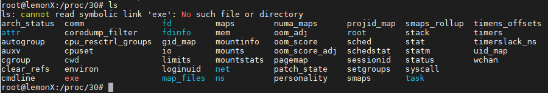
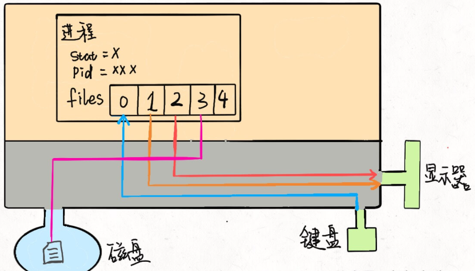
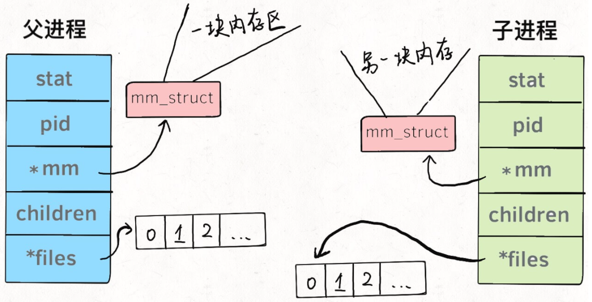
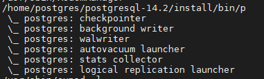
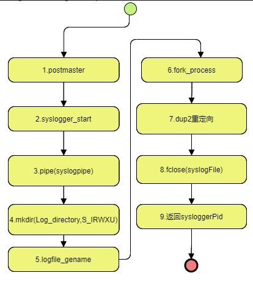
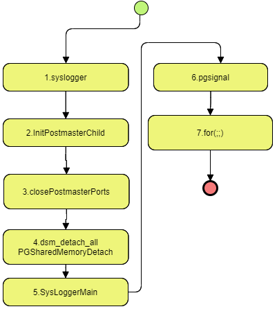

PostgreSQL(以下简称PG)在正常运行时，会拉起多个后台进程，用于处理不同的任务。本文将浅析这些后台进程具体在做些什么

# Linux进程

在阐述PG后台进程之前，先简单阐述Linux进程的特点。如对此已经熟悉，请跳过

**在Linux系统中，进程与线程本质相同，或者说几乎没有区别**。进程可以被认为是：

1. 系统资源（CPU时间、内存等）分配的基本单位
2. 是可执行程序的一个运行实例

从Linux的实现代码来说，进程相关的信息，都存放在`task_struct`结构体中（源码较为复杂， 此处只是提取了部分），它也被称为进程描述符

```c
struct task_struct {
    long state;                        // 进程状态
    struct mm_struct* mm;              // 虚拟内存结构体
    pid_t pid;                         // 进程号
    struct task_struct __rcu* parent;  // 指向父进程的指针
    struct list_head children;         // 子进程列表
    struct fs_struct* fs;              // 存放文件系统信息的指针
    struct files_struct* files;        // 一个数组，包含该进程打开的文件指针
};
```

其中，`mm`指向进程的虚拟内存，也就是载入资源和可执行文件的地方；`files`指向一个数组，这个数组里装着所有该进程打开的文件的指针。针对该`task_struct`有两点可以稍作了解：

1. 可以在任意linux系统中，找到对应的源码，例如`linux-hwe-5.13-headers-5.13.0-35/include/linux/sched.h`（最前方的`linux-hwe-5.13-headers-5.13.0-35`不一定相同，这与linux版本有关）

2. 进程的信息可以在`/proc`路径下查看，例如`pid=30的信息，就存放在`/proc/30`的文件夹下

   

## 一切皆文件

一切皆文件只是一种面向对象的设计思想，在Linux也同样采用了。比如，将进程(`/proc`)、设备(`/dev`)、Socket等等，这些本来在直观理解上并非文件的东西，都通过文件系统的规则来管理和使用，比如像普通文件一样访问、修改属性...

以操作一个摄像头为例，其按照文件系统的规范被设置为`/dev/video0`，在C语言中，调用`open(/dev/video0)`就可以连接这个设备，然后通过`read(/dev/video0)`就可以读出一帧一帧的图像

那么对于`task_struct`而言，其下的`files`数组中，每个指针实际指向的可能就是不同的硬件外设，类似如下：



### 重定向

在上述设计下，对重定向就很容易理解了。比如，程序原本需要读取键盘的输入，但是通过**输入重定向**，就可以将其指向一个文件

```shell
command < file1.txt
```

同理，通过**输出重定向**，把原本需要打印到屏幕上的文字，可以写入到一个文件中保存起来

```shell
command > file2.txt
```

**管道符**也是同样的原理，可以把一个进程的输出与另外一个进程的输入串接起来，形成一条*管道*，数据就在其中传递

```shell
command1 | command2 | command3
```

## 子进程与线程

在Linux中，一般通过`fork()`来创建子进程，通过`pthread()`创建线程。但无论是进程还是线程，都是通过`task_struct`来管理或者描述其信息，唯一的区别就是共享的数据区域不同。

1. 对子进程而言，其数据区域是父进程的拷贝。另外，在Linux中对新建子进程通常采用`copy-on-write`策略进行优化，即创建时并未实际复制父进程的内存空间，而是等到执行写操作时才会去复制
2. 对线程而言，其数据区域与父进程是共享的




# PG后台进程

PG的后台进程在不同版本稍有差别，以目前最新的版本而言，其后台进程如下：



1. `checkpointer`：
2. `background writer`：将共享内存中的脏页写入磁盘。其实手动`checkpoint`或者后台进程`checkpointer`定时任务也会将脏页写入磁盘。但是一般而言，`checkpoint`的间隔时间较长，而`bgwriter`的间隔时间很短（默认），所以`bgwriter`可以减少`checkpoint`的压力，避免大量数据同时落盘，让IO负载更平稳
3. `walwriter`：其中，`wal`的全称是`write-ahead-log`（预写式日志），即日志先于数据落盘。
4. `autovacuum`
5. `stats collector`
6. `logical replication`
6. `syslogger`：记录系统运行中的一些stderr日志，代码中通常调用`elog.h`中的`ereport`来记录日志。必须注意，sysloogger进程**非默认开启**

> 以下在`postgresql.conf`中的配置参数有很多含义表述不清，更详细的解释可以参考`src/backend/utils/misc/guc.c`中的信息。还有一些，在`guc.c`中描述的含义其实也与参数本意有所区别，这种只有通过代码才能知道了

## checkpointer

```
# - Checkpoints -

#checkpoint_timeout = 5min              # 两次自动checkpoint的最大间隔时间
#checkpoint_completion_target = 0.9     # checkpoint target duration, 0.0 - 1.0
#checkpoint_flush_after = 256kB         # measured in pages, 0 disables
#checkpoint_warning = 30s               # 如果checkpoint文件写入的频率比该参数设置的更小，则会在日志中记录告警。0表示关闭
```

在代码实现中，checkpointer由`StartCheckpointer`拉起，其执行入口为`CheckpointerMain`。`checkpointer`后台进程与手动执行`checkpoint`共用同一套核心代码，主函数为：`CreateCheckPoint`

## bgwriter

bgwriter在`postgresql.conf`下的配置参数如下：

```
# - Background Writer -

#bgwriter_delay = 200ms                 # 连续两次flush数据之间的时间的间隔，必须在10-10000ms之间
#bgwriter_lru_maxpages = 100            # 每次写的最大page数, 0表示关闭
#bgwriter_lru_multiplier = 2.0          # Multiple of the average buffer usage to free per round，必须在0-10.0之间
#bgwriter_flush_after = 512kB           # 在上一次flush后，若脏页数据量达到该数值则触发bgwriter, 0表示关闭
```

在代码实现中，bgwriter经由`StartBackgroundWriter`拉起，其执行入口为`BackgroundWriterMain`

## walwriter


## autovacuum


## stats collector


## logical replication


## syslogger

在代码实现中，syslogger经由`SysLogger_Start`拉起，其执行入口位于`syslogger.c`中的`SysLoggerMain`

需要注意的是，这个进程并不是默认开启的，需要在`postgresql.conf`中设置`logging_collector=on`来打开。其涉及到配置参数如下：

```
# - Where to Log -
log_destination = 'stderr'

# This is used when logging to stderr:
#logging_collector = off

# These are only used if logging_collector is on:
#log_directory = 'log'
#log_filename = 'postgresql-%Y-%m-%d_%H%M%S.log'
#log_file_mode = 0600
#log_rotation_age = 1d
#log_rotation_size = 10MB
#log_truncate_on_rotation = off
```

关于syslogger更详细的信息可以参见对应的官方手册：[错误报告和日志](http://www.postgres.cn/docs/14/runtime-config-logging.html)以及[日志文件维护](http://www.postgres.cn/docs/14/logfile-maintenance.html)

> 官方手册中也解释了为何syslogger并不是默认打开。它有一些缺陷，所以官方更为推荐其他的外部日志工具
>
> 1. 不够可靠，特别是有大量日志消息的情况下。比如，会有日志缺失的情况
> 2. 性能差。syslogger会把每个消息都落盘
> 3. 缺少回收机制。syslogger只负责生成日志文件，但是对旧的、不再需要的日志文件没有回收功能

### 启动流程

此处参考了[Postgresql · 源码阅读 · syslogger系统日志进程](https://www.jianshu.com/p/9bb59fa950fe)，个人虽然觉得并无总结这种后台进程启动流程的必要，但是偶然看到了一篇文章，确实流程写的清晰明了。为了防止可能网页失效等，将其存下，作为备份笔记



对应步骤为：

1. postmaster为父进程
2. syslogger_start，包括正常启动流程和syslogger异常启动流程
3. pipe(syslogpipe)创建管道，用于接收stderr/stdout输入
4. mkdir 创建日志目录文件
5. logfile_getname得到日志文件名
6. fork_process fork子进程（syslogger进程）
7. dup2 重定向stdout/stderr到syslogpipe管道
8. fclose 因为postmaster不会直接写syslogFile，所以关闭日志文件
9. 返回子进程id

### 运行



1. syslogger日志进程
2. InitPostmasterChild子进程变量初始化
3. closePostmasterPorts关闭fork父进程的端口
4. 断开和postmaster共享内存的连接
5. 业务主入口
6. 信号处理设置
7. 循环处理，包括：重载日志配置文件、日志目录、日志文件切换、日志启动时间处理、日志大小控制、读管道信息、写日志文件


